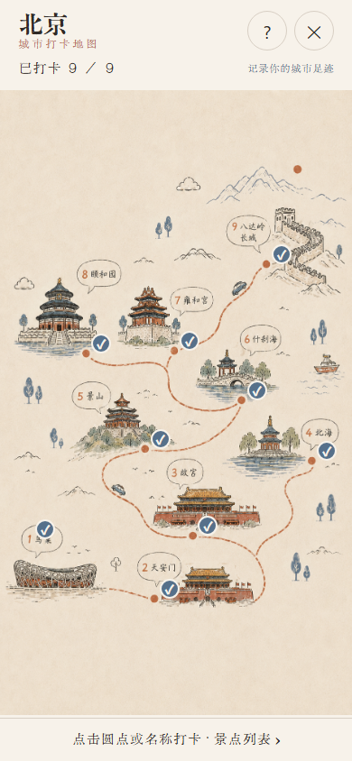
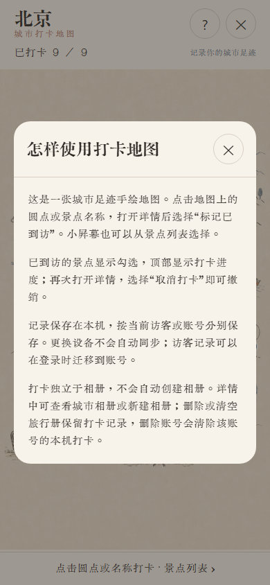

# 城市排序与插画地图打卡验收

## 范围与本地数据

本轮以 main `1bcbb0d` 为基准，独立于全球地图 PR #104。热门城市沿用上海、深圳、杭州、南京、北京、香港；其余城市按显示名称完整拼音排列，不按城市类型排列。名称、英文 ID、地区与别名仍可搜索。

`pinyin-pro@3.29.4` 只用于开发生成。新增城市或修改显示名称后运行 `npm run cities:generate`，提交生成数据；`npm run cities:check` 和完整测试检查整个目录是否匹配。生成器通过 [customPinyin](https://pinyin-pro.cn/use/customPinyin.html) 校正长春、长沙、重庆、厦门，客户端没有拼音库或中文环境排序依赖。未合并的全球目录只读载入后，273 座城市全部能生成键；合并该目录时需重新生成随包文件。

保留十张原图与相册流程。各图九个景点，共 90 个；名称和已有编号来自原图。武汉图没有编号，列表也不另造编号；无圆点景点保留名称/原编号入口。显式景点身份不随列表重排而改变。坐标是图片比例，手绘路线不代表实际地理导航。

`city_spot_checkins` 是本机 SQLite 表，以 `(ownerAccountKey, cityId, spotId)` 为主键，没有相册外键。打卡写入复用本机库保护并在成功后才更新页面；城市、账号或同账号会话变化隔离旧请求。访客检测与事务迁移包含打卡，重复景点合并保留最早时间；删除账号清除该账号记录，删除单册或清空旅行册保留打卡。记录不进入礼品共享快照，不自动创建相册或增加相册数量。

## 自动与视觉检查

- 先确认原实现的排序/热点/存储模块缺失及账号清理测试失败；帮助、详情、进度与地图点击测试在原页面失败，之后实施。重复挂载读取恢复也先复现失败再修复。
- 排序测试覆盖热门去重、完整音序、多音地名、名称/英文/别名搜索及同音 ID 顺序；生成检查覆盖完整目录。
- 热点测试覆盖十城、稳定身份、原图编号、归一坐标、四种尺寸的 contain 定位、圆点至少 44pt、名称点击与重叠最近景点。
- SQLite 测试实际打开、关闭、重开本地数据库，覆盖恢复、取消、账号/城市隔离、仅有打卡的访客库、重复迁移最早时间、事务回滚、清空相册保留打卡及写入错误。
- Hook/界面测试覆盖迟到读取和保存、账号切换、失败不显示成功、取消失败保留记录、读取重试、重复挂载、帮助关闭、列表、城市相册/新建入口及无插画城市回退。
- 本地视觉预览使用真实 React Native 地图组件、原图和本地字体，以及明确的内存打卡适配器。逐城检查 390×844 与 844×390；每城九个圆点和九个名称各在两种布局点击，共 360 次，并检查 9/9 进度、取消后 8/9、列表及帮助。截图检查发现并修复了浏览器图片按原始尺寸显示的问题。

十城截图： [北京](assets/city-checkins/beijing.png)、[上海](assets/city-checkins/shanghai.png)、[成都](assets/city-checkins/chengdu.png)、[杭州](assets/city-checkins/hangzhou.png)、[广州](assets/city-checkins/guangzhou.png)、[西安](assets/city-checkins/xian.png)、[武汉](assets/city-checkins/wuhan.png)、[深圳](assets/city-checkins/shenzhen.png)、[长沙](assets/city-checkins/changsha.png)、[重庆](assets/city-checkins/chongqing.png)。另有[横屏](assets/city-checkins/beijing-landscape.png)与[武汉无编号列表](assets/city-checkins/wuhan-list.png)。

复现视觉预览：先运行 `node scripts/preview-city-checkins.cjs --export`，完成后运行 `node scripts/serve-city-checkins-preview.cjs`，访问 `http://localhost:8095/?city=beijing`。用独立 Chrome 调试端口 9383 后，运行 `node scripts/verify-city-checkins-preview.cjs`；两个端口均可通过脚本注明的环境变量调整。脚本逐城等待原图解码成功，避免仅有点击层而没有原图的截图。浏览器字体通过 FontFace 加载同一组本地字节，以避免 Expo Web 对大 CJK 字体固定的观察超时；产品字体加载逻辑不变。原图、字体和预览均在本地，不需要产品账号或远端服务。预览内部的点击/打卡适配器用于视觉检查，不能代替 SQLite 与真实账号生命周期测试。

## 平台边界

Windows 上的本地 iOS 导出是 Expo JavaScript 与素材导出，不是签名 IPA 或 Xcode 原生编译。浏览器移动尺寸及自动测试不等同 iOS 实机、VoiceOver 或系统触摸验收；这些需要在 iPhone 上另行检查。云端构建、TestFlight、合并 main 均不在本轮授权内。

本地质量结果：干净 `npm ci`、lint、typecheck、完整测试（245 套件 / 2066 项，另有 29 项 Node 文档/站点测试）、`npm run build:server`、生成数据和发布锁文件检查均通过。`development-staging` 本地 iOS 导出成功，生成约 5.5MB Hermes bundle 与素材元数据；没有上传、云端构建或 TestFlight 操作。本机日志与导出留在忽略目录，截图随 PR 保存。

十城 360 次原图圆点/名称点击全部通过，全部城市的帮助、列表、9/9 进度与取消后 8/9 均通过，浏览器运行异常为零。已逐张查看本轮 13 张最终截图，确认实际原图、文字、勾选与弹窗，而非仅检查坐标层。
