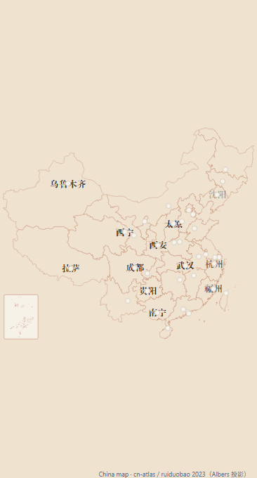
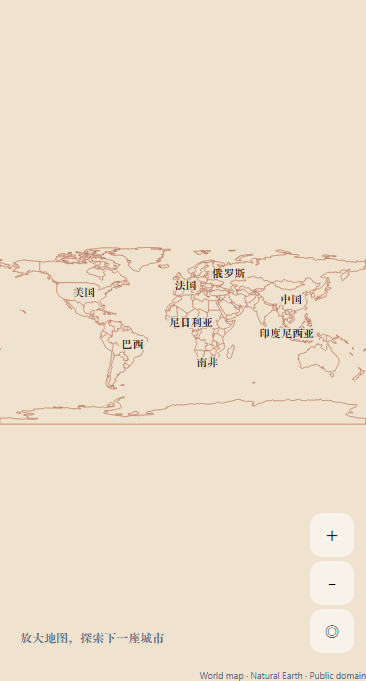
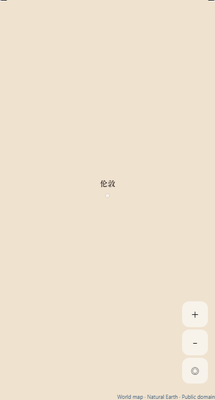

# 国内地图风格总结与国际版应用

## 参照

本次以项目现有国内地图作为参照：`ChinaMapArtwork` 的中国省界底图、`AnimatedPrefectureLabel` 的文字层、`city-label-layout.ts` 的避让规则，以及上海城市打卡图的纸张与手绘文字气质。

| 国内地图的特征 | 国际版的实际应用 |
| --- | --- |
| 暖纸色背景与陶土色省界，保留真实地理轮廓 | 同一色板绘制全球陆地与 177 个国家/地区轮廓；本地 SVG 纸纹保持固定屏幕尺寸 |
| 手账标题字体与半透明纸色文字底 | 加载原 ChaoHuaTitleA 字体；国家名、城市名使用相同文字层风格 |
| 8pt 圆点、44pt 点击区域，颜色反映已保存旅行册数量 | 保留原四档颜色和点击区域；聚合徽标缩小为 20pt，维持可选择的足迹入口 |
| 省会与重要城市优先，缩放后逐步出现更多地名 | 世界尺度优先呈现主要国家和已有足迹；放大后呈现候选城市与城市名称 |
| 标签避让和中央 72%×64% 窗口边缘淡出 | 复用边缘渐隐、4pt 间距的碰撞判断，同时避让足迹徽标；标签不捕获点击 |
| 手势连续、文字与圆点不随地图放大 | 保留 UI 线程平移/捏合与双击；文字及圆点保持屏幕尺寸，地理范围继续支持全球与日期变更线 |

国际版默认呈现旅行地图。需要街道路网时，iPhone 可切换“街道地图”，并携带当前区域；切回旅行地图也保留区域。原国内城市打卡插画及收藏流程继续使用原有内容。

## 地名与布局

国家轮廓与标签位置来自固定版本 Natural Earth。文字使用数据源地区代码生成的简短中文，并根据源标签层级确定显示密度；同层级标签按源重要度排序，避免附近较小标签挤掉主要地理参照。位置仍使用同一全球坐标，不通过移动地图轮廓或伪造地点实现视觉匹配。

未保存旅行册时，世界视图保留安静的底图和国家名，并提示放大探索。已有足迹保持可见；城市搜索直接定位到城市，点击继续使用既有城市收藏或打卡入口。

## 复现和验证

```powershell
node scripts/start-global-map-preview.cjs
node scripts/global-map-browser-smoke.cjs http://127.0.0.1:8094/ --exercise --compare-style
```

浏览器检查使用实际国内渲染器与实际国际纸质渲染器，在 390×844 视口中对照。脚本核对六地区的正确标记选择、相机平移和缩放，并确认本地标题字体已加载，保存国内参照、国际世界视图和国际城市视图截图。

自动测试覆盖默认模式、切换模式携带区域、色板/字体/圆点复用、标签显隐、文本碰撞和徽标避让，以及既有全球坐标、保存、日期变更线与地图交互。原生街道瓦片仍按 `GLOBAL-MAP.md` 的实机验收边界处理；本次风格验证不把浏览器截图当作 iPhone 实机结果。

## 实际渲染对照

下列图像直接截自同一视口中的实际组件，使用已加载的本地标题字体。国内图保留原渲染器；国际图展示世界尺度与城市尺度，地图来源标记保留在图中。

国内地图参照：



国际版世界视图：



国际版城市缩放：


